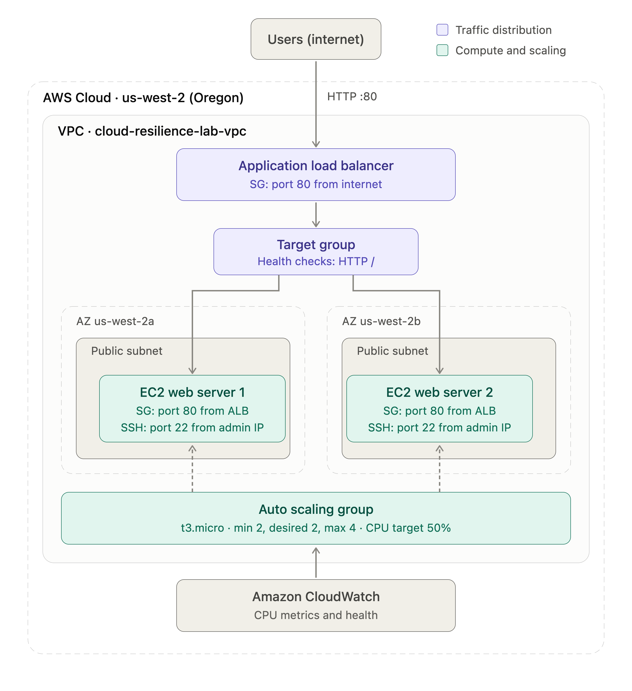
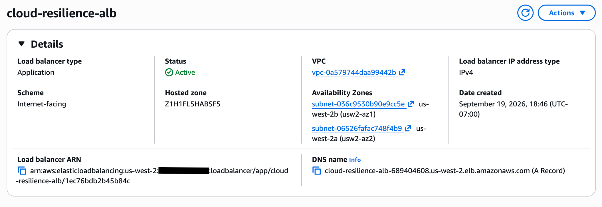
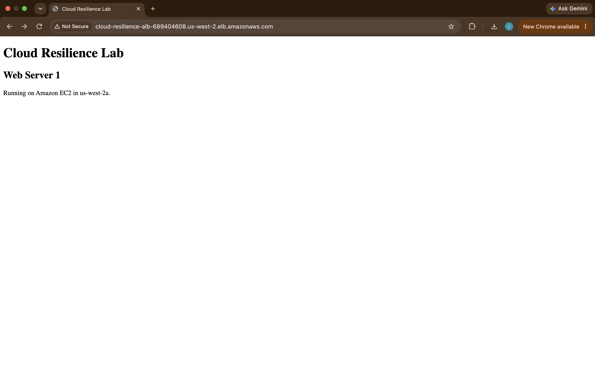
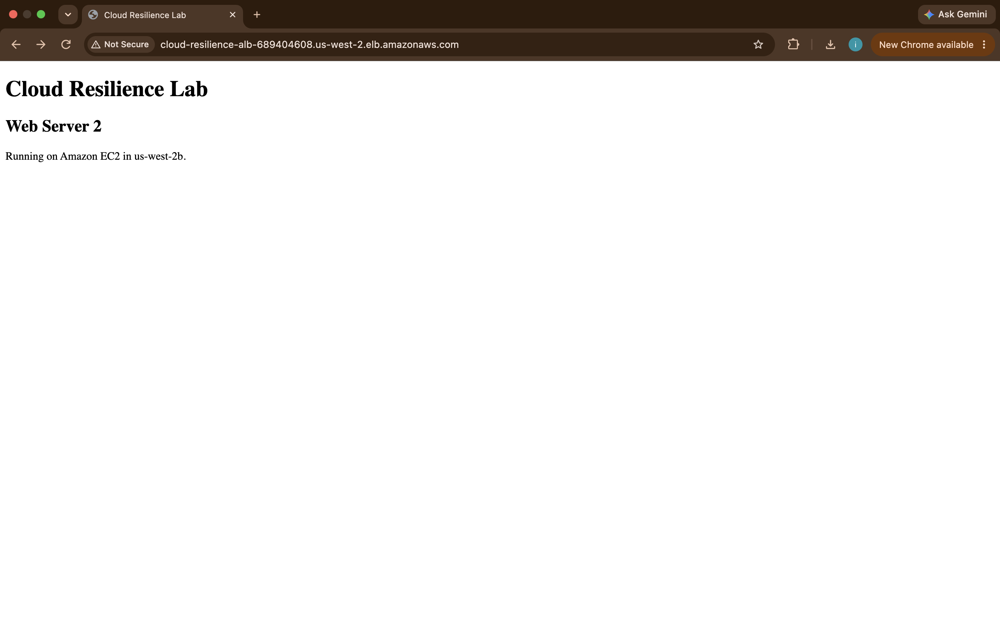
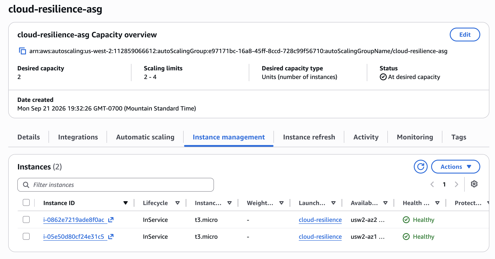
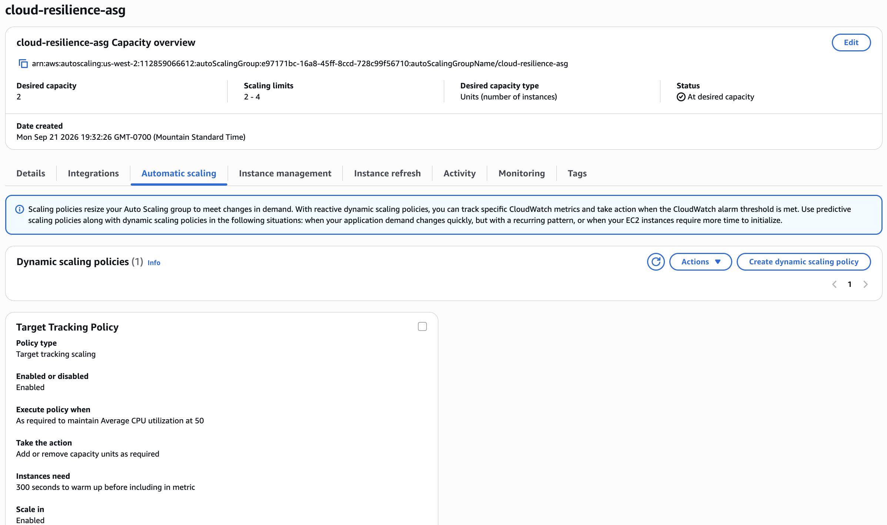
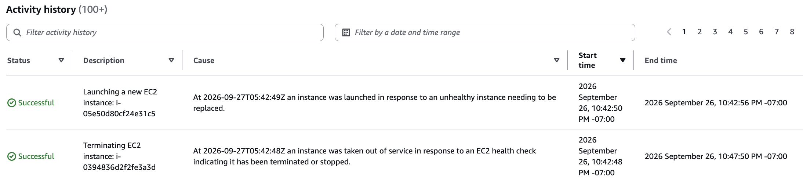

# AWS Cloud Resilience Lab

A highly available, scalable, and self-healing web infrastructure built on Amazon Web Services (AWS).

This project demonstrates how AWS compute, networking, load balancing, monitoring, and Auto Scaling services can work together to maintain application availability when infrastructure fails or demand changes.

## Project Overview

The goal of this project was to design and deploy a resilient web application architecture in AWS.

The environment uses multiple EC2 instances distributed across two Availability Zones. An Application Load Balancer distributes incoming HTTP traffic between healthy instances, while an Auto Scaling Group maintains the required number of servers and automatically replaces unhealthy instances.

I tested the resiliency of the architecture by manually terminating an EC2 instance. The Auto Scaling Group detected the loss of capacity and automatically launched a replacement instance.

## AWS Services Used

- Amazon EC2
- Application Load Balancer (ALB)
- EC2 Auto Scaling
- Amazon VPC
- Security Groups
- Amazon CloudWatch
- Target Groups

## Architecture

The application is deployed in the AWS `us-west-2` (Oregon) region across multiple Availability Zones.



### Traffic Flow

```text
                   Internet
                      |
                      | HTTP : 80
                      v
           Application Load Balancer
                      |
                      v
                 Target Group
                      |
            +---------+---------+
            |                   |
            v                   v
      EC2 Instance         EC2 Instance
       us-west-2a           us-west-2b
            |                   |
            +---------+---------+
                      |
                      v
             Auto Scaling Group
       Min: 2 | Desired: 2 | Max: 4
```

The Application Load Balancer receives incoming requests and distributes them across healthy EC2 instances in separate Availability Zones.

The Auto Scaling Group maintains application capacity and replaces unhealthy or terminated instances.

---

## Application Load Balancer

I configured an internet-facing Application Load Balancer named `cloud-resilience-alb`.

The ALB operates across two Availability Zones and forwards incoming HTTP traffic to healthy EC2 targets.



---

## Load Balancing Test

I tested the Application Load Balancer by repeatedly accessing the ALB endpoint.

Requests were routed to different EC2 web servers running in separate Availability Zones, demonstrating that the load balancer was distributing traffic across multiple backend instances.

### Web Server 1 — us-west-2a



### Web Server 2 — us-west-2b



---

## Auto Scaling Group

I configured an Auto Scaling Group named `cloud-resilience-asg`.

The group was configured with:

- Minimum capacity: 2 instances
- Desired capacity: 2 instances
- Maximum capacity: 4 instances
- Instance type: `t3.micro`
- Instances distributed across multiple Availability Zones

The Auto Scaling Group maintains the desired number of healthy EC2 instances.

### Healthy Auto Scaling Instances

The screenshot below shows two EC2 instances in service and reporting a healthy status.



---

## Dynamic Scaling Policy

I configured a target tracking scaling policy using average EC2 CPU utilization.

Configuration:

- Policy type: Target tracking scaling
- Target average CPU utilization: 50%
- Instance warm-up period: 300 seconds
- Scale in: Enabled
- Capacity can automatically increase or decrease as required

This allows the Auto Scaling Group to adjust capacity based on application demand while remaining within the configured scaling limits.



---

## Self-Healing Test

I tested the fault-tolerance and self-healing behavior of the environment by manually terminating an EC2 instance managed by the Auto Scaling Group.

After the instance was terminated, the Auto Scaling Group detected the loss of capacity and automatically launched a new EC2 instance to restore the desired capacity of two instances.

The activity history shows the terminated instance being taken out of service and a replacement EC2 instance being launched successfully.



This test demonstrated that the infrastructure can automatically recover from an EC2 instance failure without requiring manual replacement of the failed server.

---

## Security

Security groups were configured to control network traffic between the internet, Application Load Balancer, and EC2 web servers.

The configuration included:

- The Application Load Balancer accepts HTTP traffic on port 80.
- EC2 web servers accept HTTP traffic from the Application Load Balancer security group.
- SSH access on port 22 is restricted to an authorized administrator IP address.
- Security group rules limit unnecessary direct access to the web servers.

This creates separation between the public-facing load balancer and the backend EC2 instances.

---

## Monitoring and Scaling

Amazon CloudWatch metrics are used by the Auto Scaling target tracking policy to monitor average CPU utilization.

When utilization changes relative to the configured 50% target, the Auto Scaling Group can adjust the number of EC2 instances while remaining between the configured minimum and maximum capacity.

This connects monitoring directly with automated infrastructure scaling.

---

## What I Tested

During this project, I validated:

- Application Load Balancer connectivity
- Traffic distribution across multiple EC2 instances
- Multi-Availability Zone deployment
- EC2 target availability
- Auto Scaling desired capacity
- CPU-based target tracking
- Automatic EC2 replacement after instance termination
- Security group communication between the ALB and web servers

---

## What I Learned

This project gave me hands-on experience with core AWS cloud and infrastructure concepts, including:

- High availability
- Fault tolerance
- Load balancing
- Auto Scaling
- Self-healing infrastructure
- EC2 instance management
- AWS networking
- Security groups
- CloudWatch monitoring
- Multi-AZ architecture

The project demonstrated how multiple AWS services can work together to create infrastructure that is more resilient than relying on a single server.

---

## Future Improvements

Future improvements I could make to this architecture include:

- Add HTTPS using AWS Certificate Manager
- Configure Route 53 and a custom domain
- Place application servers in private subnets
- Add NAT gateways for controlled outbound connectivity
- Rebuild the infrastructure using Terraform
- Add CloudWatch alarms and SNS notifications
- Implement a CI/CD pipeline for automated deployments

---

## Author

**Abdiwahid Adde**

Cloud Infrastructure / Networking Project
